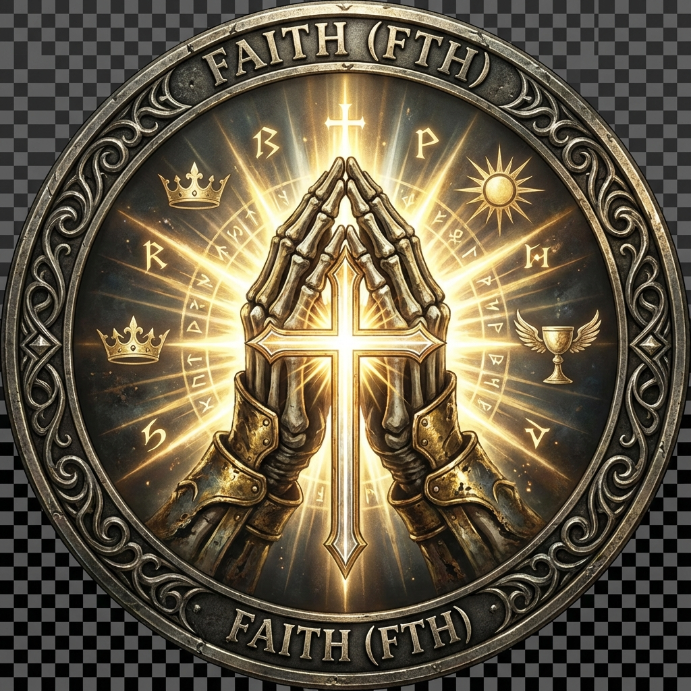

# 🔥 Souls DEX - Merkeziyetsiz Borsa Oyunu

> *"To gain Intelligence, you must sacrifice Faith.*  
> *To gain Faith, you must sacrifice Intelligence."*

⚡ **Sacrifice to Ascend** ⚡

---

## � Proje Hakkında

**Souls DEX**, AMM (Automated Market Maker) ve merkeziyetsiz borsa mantığının daha iyi kavranabilmesi için geliştirilmiş, **eğitici ve eğlenceli bir blockchain oyunudur**. 

Bu proje, karmaşık DeFi (Decentralized Finance) kavramlarını **Dark Souls** evreninden ilham alan bir tema ile birleştirerek, öğrenmeyi eğlenceli hale getirir. Oyuncular, Intelligence (INT) ve Faith (FTH) tokenları arasında swap yaparak, likidite sağlayarak ve seviye atlayarak hem blockchain teknolojilerini öğrenir hem de stratejik bir oyun deneyimi yaşar.

**Uniswap V2** constant product formula (x*y=k) üzerine kurulu olan bu DEX, gerçek dünya DeFi protokollerinin nasıl çalıştığını anlamak için mükemmel bir öğrenme aracıdır. %1 swap fee mekanizması, likidite sağlama teşvikleri, ve güvenlik özellikleri ile production-grade bir DeFi uygulamasının tüm temel bileşenlerini içerir.

**Öğrenme Hedefleri:**
- 🔄 AMM mekanizması ve constant product formula
- 💧 Likidite havuzları ve LP token'lar
- 💰 Fee mekanizmaları ve dağıtımı
- 🔐 Smart contract güvenliği (Reentrancy Guard, access control)
- ⚡ Blockchain etkileşimi (Viem kütüphanesi)
- 🎮 Gamification ile DeFi

---

## �🎮 Token Sembolleri

<p align="center">
  
  
</p>

### 🧠 Intelligence (INT)
Bilgi ve büyünün gücü. Sihirbazlar ve bilginler bu özelliği geliştirir.  
Yüksek Intelligence, güçlü büyüler ve karmaşık stratejiler sağlar.

### 🙏 Faith (FTH)
Mucizeler ve adanmışlığın gücü. Rahipler ve şövalyeler bu özelliği geliştirir.  
Yüksek Faith, kutsal büyüler ve koruma sağlar.

---

## 📖 Hikaye

**Souls DEX**, Tarnished'ların bir özelliği güçlendirmek için diğerini feda ettiği kutsal bir yerdir. AMM (Automated Market Maker) mekanizması sayesinde, her fedakarlık dengeyi korur:

```
x * y = k
```

---

## 🎮 Seviye, Rank & Class Sistemi

### Seviye Hesaplama
```
Level = (INT Tokens / 100) + (FTH Tokens / 100)
```

**Örnek:**
- 500 INT + 500 FTH = Level 10

### Rank Sistemi

| Level | Rank | Emoji | Açıklama |
|-------|------|-------|----------|
| 0-9 | **Survivor** | 🔪 | Hayatta kalan, mücadele eden |
| 10-19 | **Warrior** | ⚔️ | Deneyimli savaşçı |
| 20+ | **Legend** | 🌟 | Usta, efsanevi güç |

### Class Sistemi

Tokenlarının dağılımına göre otomatik class belirlenir:

| Class | Emoji | Koşul | Açıklama |
|-------|-------|-------|----------|
| **Büyücü** | 🔮 | INT > FTH | Sihir ve zeka odaklı |
| **Rahip** | ✨ | FTH > INT | İnanç ve mucize odaklı |
| **Günahkar** | 🎭 | INT = FTH | Dengeli, her iki güç |

---

## ✨ Özellikler

### Ana Menü
- ⚡ **Likidite Ekle** - Havuza INT + FTH ekle
- ⚔️ **Swap (Fedakarlık)** - Bir özelliği diğeriyle takas et (%1 fee)
- 💀 **Ruh Transferi** - Başka Tarnished'lara token gönder
- 🪙 **Mint (Founder Only)** - Sadece kurucu yeni token basabilir
- 🔄 **Wallet Değiştir** - Private key ile güvenli geçiş
- 📊 **Seviyemi Gör** - Kendi level, rank ve class'ını gör
- 👥 **Tüm Tarnished'lar** - Tüm savaşçıların seviyelerini gör
- 💧 **Havuz Bilgileri** - Pool rezervleri ve fiyat oranları
- 📈 **Yükseliş İstatistikleri** - Oyun süren, token değişimi, gelişim yüzdesi
- 🛡️ **Güvenlik Sistemleri** - 4 aktif güvenlik özelliği

### Güvenlik Özellikleri (4/4 Aktif)
1. ✅ **Reentrancy Guard** - Tekrarlı çağrı saldırısı koruması
2. ✅ **Private Key Authentication** - Wallet değiştirmek için private key gerekli
3. ✅ **Proportional Liquidity** - Havuz oranını korur, manipülasyonu önler
4. ✅ **Owner-Only Minting** - Sadece founder token basabilir

---

## 🛠️ Teknolojiler

### Blockchain
- **Solidity** ^0.8.23
- **Foundry** (Anvil local blockchain)
- **OpenZeppelin** Contracts (ERC20, ReentrancyGuard)

### Smart Contracts
- `MockToken.sol` - ERC20 token (Intelligence & Faith)
- `SoulsDEX.sol` - AMM DEX (Uniswap V2 mantığı + %1 fee)

### JavaScript
- **Viem** - Blockchain etkileşimi
- **Inquirer** - İnteraktif CLI menü
- **Node.js** - Runtime

---

## 🚀 Kurulum

### Gereksinimler
- Node.js v18+
- Foundry (Anvil)

### Adımlar

1. **Projeyi klonla**
```bash
git clone <repo-url>
cd dex-proje
```

2. **Bağımlılıkları yükle**
```bash
npm install
```

3. **Anvil'i başlat** (Ayrı bir terminal)
```bash
npm run anvil
```

4. **Uygulamayı başlat**
```bash
npm start
```

---

## 🎮 İlk Çalıştırma (Deployment)

İlk kez `npm start` çalıştırdığında, interaktif deployment başlar:

```
╔═══════════════════════════════════════════╗
║          ⚡ SOULS DEX ⚡                  ║
║       "Sacrifice to Ascend"               ║
╚═══════════════════════════════════════════╝

⚠️  Kontratlar henüz deploy edilmemiş!

? Deployment başlasın mı? (Y/n)

─────────────────────────────────────────

ADIM 1: 🧠 Intelligence Token Deploy
? Kendi adresine kaç INT basılsın? 1600
✅ Deployed: 0xabc... (Blok #1)

ADIM 2: 🙏 Faith Token Deploy
? Kendi adresine kaç FTH basılsın? 400
✅ Deployed: 0xdef... (Blok #2)

ADIM 3: 🔥 SoulsDEX Deploy
✅ Deployed: 0x123... (Blok #3)

ADIM 4: ⚔️  Diğer Tarnished'lara Ruh Dağıt
→ 9 adrese 500 INT + 500 FTH
✅ Dağıtım tamamlandı! (Blok #4-21)

ADIM 5: 💧 Havuza İlk Likidite
→ 5000 INT + 5000 FTH
✅ Likidite eklendi! (Blok #22)

─────────────────────────────────────────

🎉 Deployment Tamamlandı!
📝 .env dosyası güncellendi
📊 Yükseliş istatistikleri kaydedildi

⚡ Ana menüye geçiliyor...
```

### Başlangıç Dağılımı
- **Founder (Wallet #0)**: Kendi seçimi (örn: 1600 INT, 400 FTH = Level 20, Legend, Büyücü)
- **Diğer 9 Tarnished**: 500 INT + 500 FTH (Level 10 - Warrior, Günahkar)
- **DEX Havuzu**: 5000 INT + 5000 FTH (düşük price impact)

---

## 🎮 Ana Menü

```
╔═══════════════════════════════════════════╗
║          🔥 SOULS DEX 🔥                  ║
║       "Sacrifice to Ascend"               ║
╚═══════════════════════════════════════════╝

📡 Anvil RPC: http://127.0.0.1:8545
⚰️  Current Tarnished: 0xf39F...
⚔️ Rank: Warrior (Level 17)
🔮 Class: Büyücü

? Ne yapmak istersin?

  ⚡ Likidite Ekle
  ⚔️  Swap (Fedakarlık)
  💀 Ruh Transferi
  🪙 Token Mint Et (Sadece Founder)
  🔄 Wallet Değiştir
  📊 Seviyemi Gör
  👥 Tüm Tarnished Seviyelerini Görüntüle
  💧 Havuz Bilgilerini Gör
  📈 Yükseliş İstatistikleri
  🛡️  Güvenlik Sistemleri
  🔥 Çıkış
```

---

## 🎯 Kullanım Örnekleri

### 1. Swap (Fedakarlık)
```
? Hangi özelliğini feda edeceksin?
❯ Intelligence → Faith (Bilgeliği feda et)
  Faith → Intelligence (İnancı feda et)

? Fedakarlık miktarı: 100

⏳ Fedakarlık sunuluyor...
✅ Fedakarlığın kabul edildi! (Blok #45)

Fee: 1 INT (%1)
Alınan: ~99 FTH
```

### 2. Wallet Değiştir (Private Key)
```
=== 🔄 WALLET DEĞİŞTİR ===

⚠️  Private key gereklidir!

? Private key girin: ************************************************************

✅ Wallet doğrulandı!
✅ Değiştirildi: 0x7099...
⚔️ Warrior (Level 10)
🎭 Hoşgeldin, Günahkar!
```

### 3. Yükseliş İstatistikleri
```
╔═══════════════════════════════════════════════════════════╗
║              📈 YÜKSELİŞ İSTATİSTİKLERİ 📈               ║
╚═══════════════════════════════════════════════════════════╝

⏱️  Oyun Süresi: 15 dakika 32 saniye

━━━━━━━━━━━━━━━━━━━━━━━━━━━━━━━━━━━━━━━━━━━━━━━━━━━━━━━━━

🧠 INTELLIGENCE
   Başlangıç: 500 INT
   Şu An:     650 INT
   Değişim:   +150 INT (+30%)
   Gelişim:   ⬆️ Artan

🙏 FAITH
   Başlangıç: 500 FTH
   Şu An:     420 FTH
   Değişim:   -80 FTH (-16%)
   Gelişim:   ⬇️ Azalan

━━━━━━━━━━━━━━━━━━━━━━━━━━━━━━━━━━━━━━━━━━━━━━━━━━━━━━━━━

⚡ TOPLAM YÜKSELİŞ
   Başlangıç Toplam: 1000 token
   Şu Anki Toplam:   1070 token
   Net Gelişim:      +70 token (+7%)
   
   Seviye: 10 → 10 (Değişmedi)
   Rank:   ⚔️ Warrior
   Class:  🔮 Büyücü

━━━━━━━━━━━━━━━━━━━━━━━━━━━━━━━━━━━━━━━━━━━━━━━━━━━━━━━━━

💡 Büyücü yolunda ilerliyorsun! Intelligence artıyor.
```

### 4. Tüm Tarnished Seviyeleri
```
=== 👥 TÜM TARNISHED SEVİYELERİ ===

 #  Address          INT   FTH   Level  Rank              Class
─────────────────────────────────────────────────────────────────
 0  0xf39F...       1600   400    20   🌟 Legend         🔮 Büyücü
 1  0x7099...        500   500    10   ⚔️ Warrior        🎭 Günahkar
 2  0x3C44...        500   500    10   ⚔️ Warrior        🎭 Günahkar
 3  0x9096...        200   100     3   🔪 Survivor       🔮 Büyücü
 ...
```

---

## 🧪 Teknik Detaylar

### AMM Mekanizması (Uniswap V2 + %1 Fee)

**Constant Product Formula:**
```
reserveIntelligence * reserveFaith = k (constant)
```

**Swap Hesaplama (with 1% fee):**
```
amountInWithFee = amountIn * 990  // %1 fee
amountOut = (amountInWithFee * reserveOut) / (reserveIn * 1000 + amountInWithFee)
```

**Price Impact:**
- 5000'lik havuz sayesinde düşük slippage
- 100 token swap → ~%2 impact
- 500 token swap → ~%9 impact

**Fee Distribution:**
- %1 fee havuzda kalır
- Likidite sağlayanlar orantılı olarak kazanır
- ~680 swap sonra başabaş (100 token likidite için)

### Seviye & Class Sistemi
- **Dinamik hesaplama**: Her sorguda güncel bakiye
- **Rank gösterimi**: Emoji + isim (Survivor/Warrior/Legend)
- **Class belirleme**: INT vs FTH karşılaştırması
- **Tablo formatı**: Tüm Tarnished'lar için düzenli görünüm

### Yükseliş İstatistikleri
- **Oyun süresi**: Deployment'tan itibaren
- **Token değişimi**: Başlangıç vs şu anki
- **Gelişim yüzdesi**: Her token için ayrı
- **Dinamik mesajlar**: Class'a göre özelleştirilmiş

---

## 📁 Proje Yapısı

```
dex-proje/
├── src/
│   ├── MockToken.sol       # ERC20 token (owner-only mint)
│   └── SoulsDEX.sol         # AMM DEX kontratı (%1 fee)
├── script/
│   └── app.js              # TEK ANA SCRIPT (tüm özellikler)
├── assets/
│   ├── intelligence_logo.png  # INT token logosu
│   └── faith_logo.png         # FTH token logosu
├── .env                    # Kontrat adresleri
├── stats.json              # Yükseliş istatistikleri
├── ANVIL_ACCOUNTS.txt      # Anvil private keys (gitignore)
├── foundry.toml            # Foundry konfigürasyonu
└── package.json            # Node.js bağımlılıkları
```

---

## 🎯 Öğrenilen Kavramlar

- ✅ **AMM (Automated Market Maker)** - Uniswap V2 mantığı
- ✅ **Constant Product Formula** - x * y = k
- ✅ **Fee Mechanism** - %1 swap fee ve dağıtımı
- ✅ **Price Impact** - Büyük işlemlerin fiyata etkisi
- ✅ **Liquidity Pools** - Likidite havuzları nasıl çalışır
- ✅ **ERC20 Token Standard** - OpenZeppelin implementasyonu

---

## 👥 Ekip

- **Yusuf Bürlükkara**
- **Feyyaz**

**ITU Blockchain** - 7. Hafta Projesi

---

## 📜 Lisans

MIT License

---

## 🔗 Kaynaklar

- [Uniswap V2 Docs](https://docs.uniswap.org/contracts/v2/overview)
- [Viem Documentation](https://viem.sh)
- [Foundry Book](https://book.getfoundry.sh)
- [OpenZeppelin Contracts](https://docs.openzeppelin.com/contracts)

---

⚔️ **Praise the Sun!** ☀️
